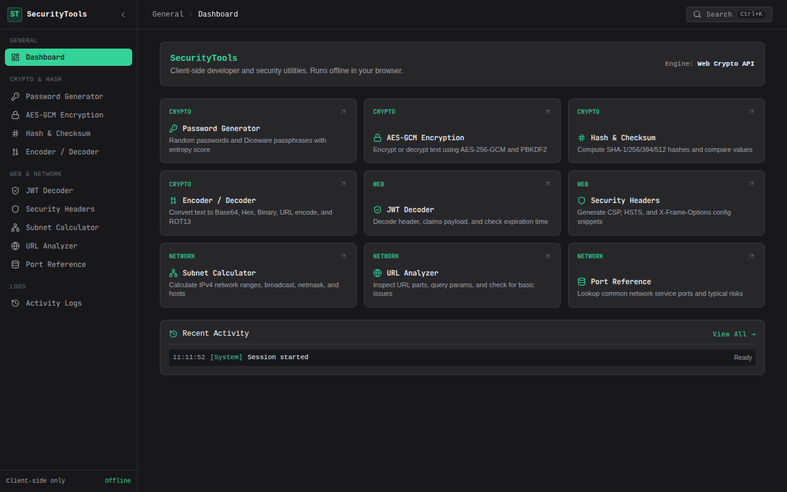
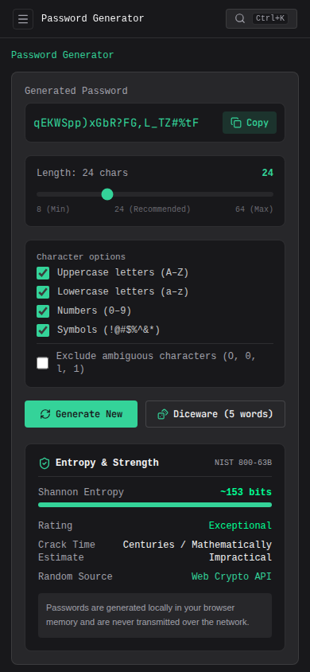

<div align="center">

```
  ____                 _ _        _____             _     
 / ___|  ___  ___ _   _| (_) |_ _|_   _|__   ___  | |___ 
 \___ \ / _ \/ __| | | | | | __| | | |/ _ \ / _ \ | / __|
  ___) |  __/ (__| |_| | | | |_  | | | (_) | (_) || \__ \
 |____/ \___|\___|\__,_|_|_|\__| |_|  \___/ \___(_)_|___/
```

### An offline-first, client-side toolkit for everyday security & dev tasks.

[](https://react.dev/)
[](https://www.typescriptlang.org/)
[](https://vitejs.dev/)
[](https://tailwindcss.com/)
[](https://developer.mozilla.org/en-US/docs/Web/API/Web_Crypto_API)
[](LICENSE)

<br />

<p align="center">
  <a href="#-why-this-exists">Why This Exists</a> •
  <a href="#-tool-matrix">Tools Included</a> •
  <a href="#-how-encryption-works">Encryption Flow</a> •
  <a href="#-shortcuts">Shortcuts</a> •
  <a href="#-getting-started">Getting Started</a> •
  <a href="#-mobile-access">Mobile Access</a>
</p>

---



</div>

<br />

## 💡 Why This Exists

We often need quick utilities during daily work:
- Decoding a JWT to check claim expiration.
- Generating a strong, high-entropy password or Diceware passphrase.
- Calculating usable hosts in a `/27` CIDR subnet.
- Verifying a SHA-256 checksum against a downloaded binary.
- Encrypting an API secret or config blob before sharing it over Slack/Teams.

Most online web tools send your input to a remote backend server, exposing sensitive tokens, passwords, and private IP ranges. 

**SecurityTools runs 100% in your local browser sandbox.**
- Zero network requests (`fetch` / `XHR` / analytics).
- Powered by native browser hardware primitives (`window.crypto.subtle` and `window.crypto.getRandomValues`).
- Works offline once loaded.

---

## 🧰 Tool Matrix

| Tool | Shortcut | What It Does |
|---|:---:|---|
| **Password Generator** | `Ctrl + 1` | CSPRNG password & 5-word Diceware generator with Shannon entropy and crack time estimates. |
| **Hash & Checksum** | `Ctrl + 2` | Compute SHA-1, SHA-256, SHA-384, and SHA-512 with a constant-time match verifier. |
| **JWT Decoder** | `Ctrl + 3` | Parse JOSE header, claims payload, algorithm, and live expiration countdown. |
| **URL Analyzer** | `Ctrl + 4` | Deconstruct URL parts, query params, protocol warnings, and injection heuristics. |
| **Subnet Calculator** | `Ctrl + 5` | Calculate network ID, usable host range, broadcast, netmask, wildcard, and binary mask. |
| **AES-GCM Vault** | `Ctrl + 6` | Authenticated 256-bit symmetric encryption with PBKDF2 (100k rounds) key derivation. |
| **Encoder / Decoder** | `Ctrl + 7` | Real-time conversion across Base64, Base64URL, Hex, Binary, URL encode, HTML, and ROT13. |
| **Security Headers** | `Ctrl + 8` | Generate hardened CSP, HSTS, and X-Frame-Options snippets for Nginx, Caddy, Cloudflare, Next.js. |
| **Port Reference** | — | Quick searchable matrix of 27 standard network ports and associated threat vectors. |
| **Activity Logs** | — | In-memory session audit trail with 1-click JSON export. |

---

## 🔐 How Encryption Works

For AES-GCM operations, key derivation and data authentication follow standard cryptographic practices:

```text
┌────────────────┐      ┌─────────────────────────┐
│ User Passphrase│ ───► │ PBKDF2-HMAC-SHA256      │ (100,000 Iterations)
└────────────────┘      │ + 16-byte CSPRNG Salt   │
                        └──────────┬──────────────┘
                                   │
                                   ▼ [256-bit Key]
┌────────────────┐      ┌─────────────────────────┐
│ Plaintext Data │ ───► │ AES-256-GCM Encryption  │ ◄── [12-byte CSPRNG IV]
└────────────────┘      └──────────┬──────────────┘
                                   │
                                   ▼
                        ┌─────────────────────────┐
                        │ Sealed JSON Envelope    │
                        │ • Ciphertext (Base64)   │
                        │ • Auth Tag (128-bit)    │
                        │ • Salt & IV (Base64)    │
                        └─────────────────────────┘
```

> **Integrity Guarantee**: AES-GCM includes a 128-bit authentication tag (GMAC). If even a single bit in the ciphertext is modified, decryption fails and rejects the payload before exposing data.

---

## ⌨️ Shortcuts

Press `Ctrl + K` (or `Cmd + K` on macOS) anywhere to open the fuzzy search palette:

```text
  Ctrl + 0  ──►  Dashboard
  Ctrl + 1  ──►  Password Generator
  Ctrl + 2  ──►  Hash & Checksum
  Ctrl + 3  ──►  JWT Decoder
  Ctrl + 4  ──►  URL Analyzer
  Ctrl + 5  ──►  Subnet Calculator
  Ctrl + 6  ──►  AES-GCM Encryption
  Ctrl + 7  ──►  Encoder / Decoder
  Ctrl + 8  ──►  Security Headers
```

---

## 📱 Mobile Access

The entire interface is responsive and touch-optimized for mobile devices.

<div align="center">
  
</div>

<br />

To access SecurityTools on your phone over local Wi-Fi:

```bash
# 1. Run the local mobile gateway
serve-mobile 8080

# 2. Open the URL or scan the printed terminal QR code on your phone
http://<YOUR_LOCAL_IP>:8080
```

---

## 🚀 Getting Started

### Prerequisites
- Node.js (v18 or higher)
- npm / pnpm / yarn

### Local Development
```bash
# 1. Clone repo
git clone https://github.com/h1ntz0/SecurityTools-main.git
cd SecurityTools-main

# 2. Install dependencies
npm install

# 3. Start Vite dev server
npm run dev
```

Visit `http://localhost:5173`.

### Production Build
```bash
npm run build
```
Static files will be compiled into the `dist/` directory.

### Nginx Example Virtual Host
```nginx
server {
    listen 80;
    listen 8080;
    server_name _;

    root /var/www/securitytools/dist;
    index index.html;

    gzip on;
    gzip_types text/plain text/css application/json application/javascript image/svg+xml;

    location /assets/ {
        expires 1y;
        add_header Cache-Control "public, immutable";
        try_files $uri =404;
    }

    location / {
        try_files $uri $uri/ /index.html;
        add_header Cache-Control "no-store, no-cache, must-revalidate" always;
    }
}
```

---

## 🎨 Theme & Palette

Designed with a calm, high-contrast 3-color dark mode:
- **Canvas & Panels**: `#18181B` (Zinc-900) & `#27272A` (Zinc-800)
- **Accent**: `#34D399` (Soft Sage Green)
- **Typography**: `#F4F4F5` (Soft Off-White) & `#A1A1AA` (Muted Slate)

---

## 📄 License

Distributed under the [MIT License](LICENSE). Built for security practitioners and developers.
